# OnlineShop Greatkart

This is representative application made with Python and Django framework.
It is almost fully functional web shop application. It contains:
- registration system for new users with custom email authentication mechanism,
- functional cart with possibility to add/remove and modifiy its elements,
- mechanism of changing and resetig user password,
- allows user to change his account data,
- review and comments of products,
- simulation of placing order and billing system witch PayPal developer account (You myust create one to use this option),


## Cloning the repo and starting app

1. Create virtual enviroment in your directory:
```
python3 -m venv venv
```
2. Clone the repo to your directory:
```
git clone https://github.com/Daw-Kla/Online_Shop.git
```
3. Start virtual enviroment:
```
. venv/bin/activate
```
4. Install all dependencies:
```
pip3 install -r requirements.txt
```
5. Change the .env-sample file:

Change required fields for app to run.
This file is used by python decouple package to make project more safe when it is shared with others.
I was using g-mail account to receiving app messages when creating an account or resetting password so variables EMAIL_HOST and EMAIL_PORT will remain the same if you will also use g-mail.

Google has changed access to less secure apps. Before that, there was a field to give access to. Now you can follow these steps;

The steps have changed slightly

First Step
Go to Google Account Page>Security>Signing in to Google section turn on 2-Step Verification. You need this feature on.

Second Step
When 2SV is on, click 2-Step Verification, scroll to the bottom to App Password.

Generate new-app-password for mail access. It will generate it for you (6 characters code use as a password), then use this password in EMAIL_HOST_PASSWORD variable in .env-sample file.

After all change the name of the file from ".env-sample" to ".env". Your file should look like that:

DO NOT USE CHARS LIKE ".,/:;*&# AND WHITESPACE IN THIS FILE
```
.env/

SECRET_KEY=djangoSeceretKeyGeneratedByDjango
DEBUG=True
EMAIL_HOST=smtp.gmail.com
EMAIL_PORT=587
EMAIL_HOST_USER=user.email@gmail.com 
EMAIL_HOST_PASSWORD=16digitCodeGeneratedByGoogleAccount
EMAIL_USE_TLS=True
```
6. Start application:
```
python3 manage.py runserver
```
7. Create superuser:
```
python3 manage.py createsuperuser
```
8. Populate database with sample data using admin panel:
- Categories
- Products
- Product variations

#### Now You are ready to play with whole application:

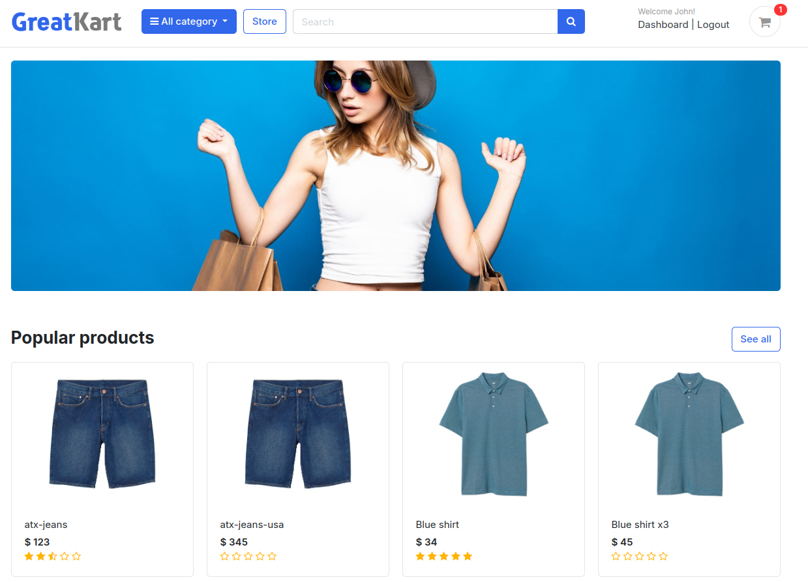

#### Sign up as new user:
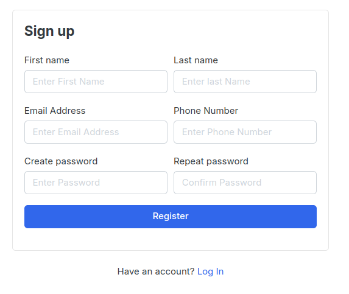

#### after filling the form check Your gmail account for atcivaton link:

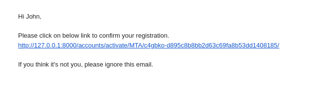

#### You can go to store to see all products and categories:
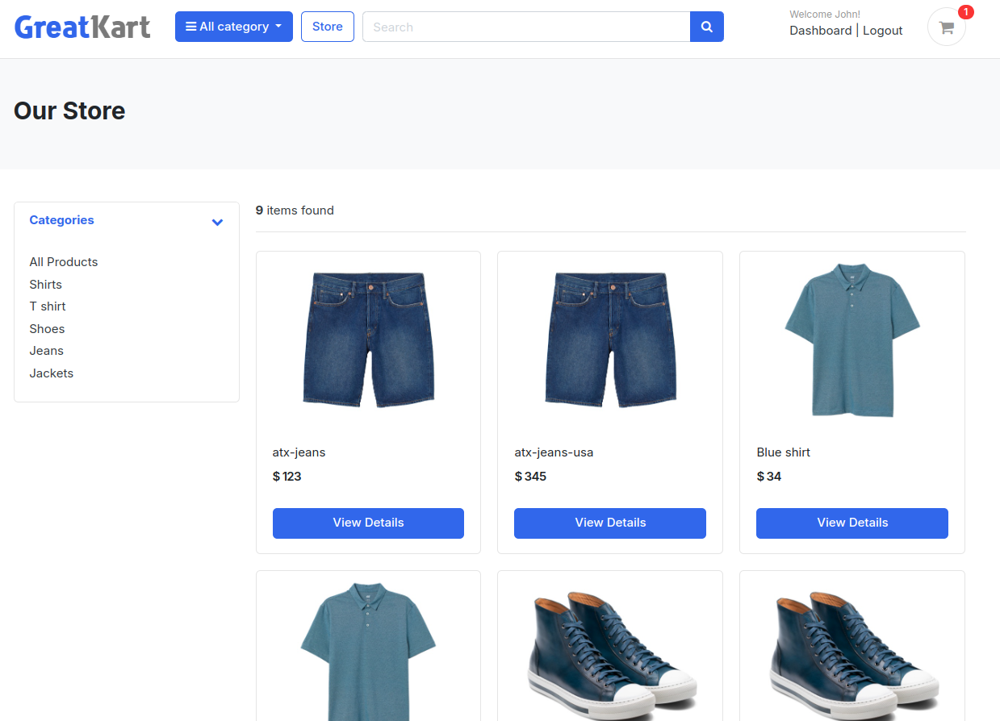

#### After click on some product there will be:
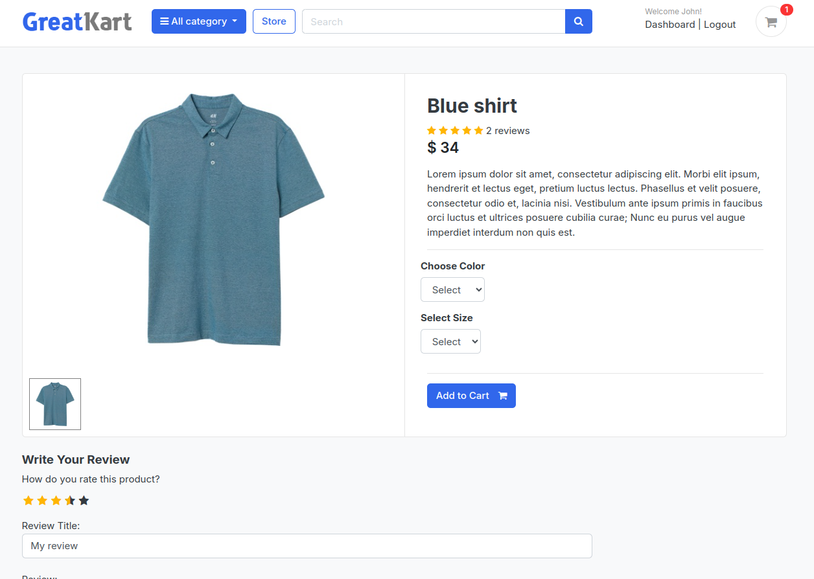

#### You can select variation (color/size) and add it to cart:
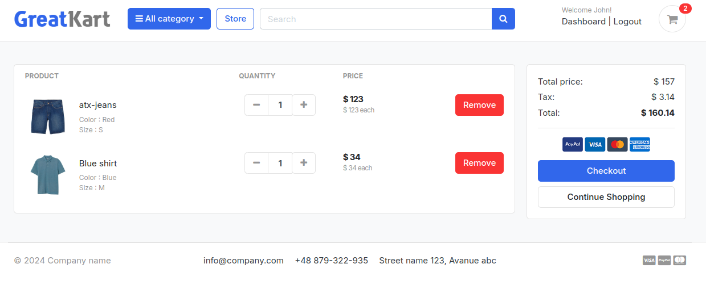

#### If you are not logged in you won't be able to checkout the cart:
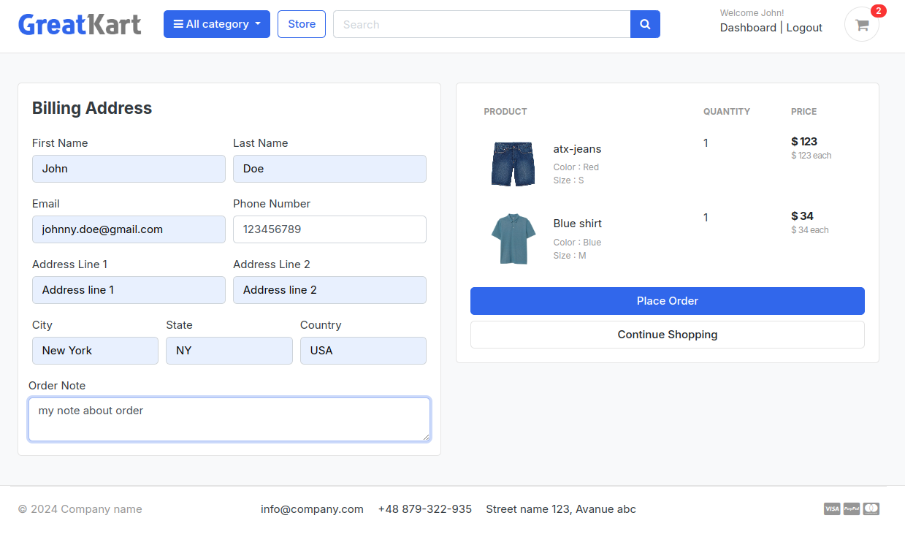

#### After filling the order form You can place an order:
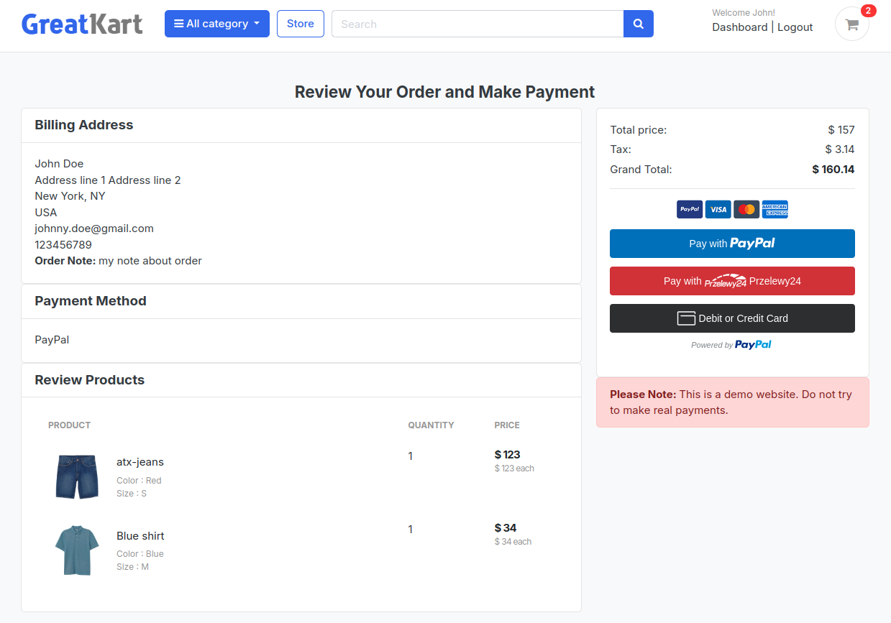

#### And play with payments:
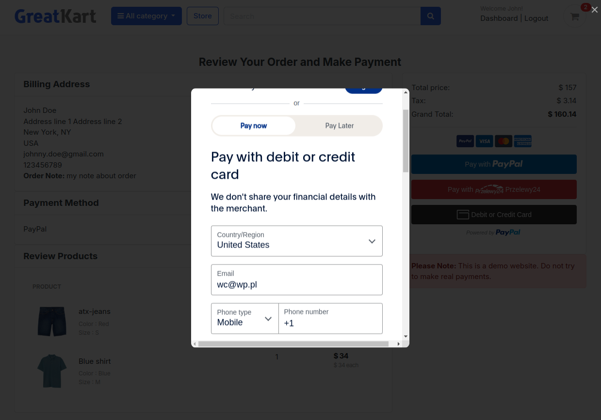

#### After succesfull payment you can check the dashboar of your user:
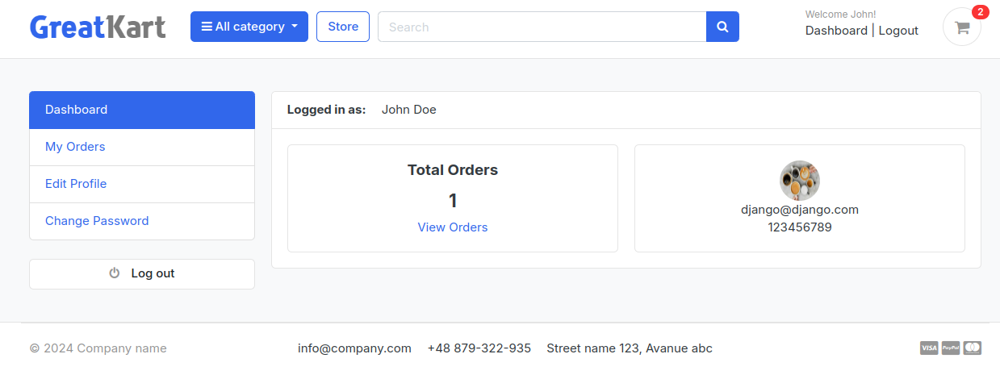

#### Where you can see your orders:
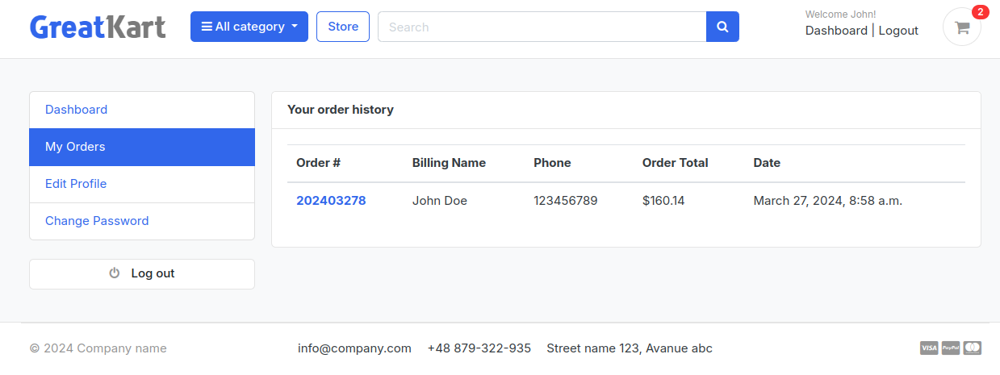

#### and its details:
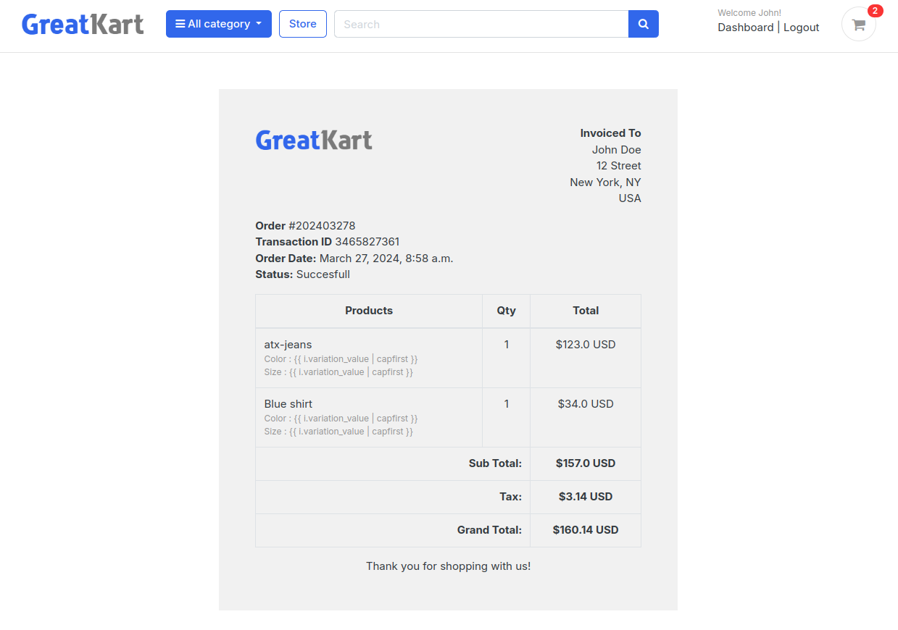

#### or edit profile information:
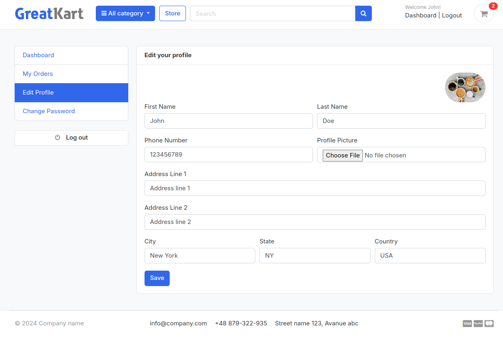

#### or change password:
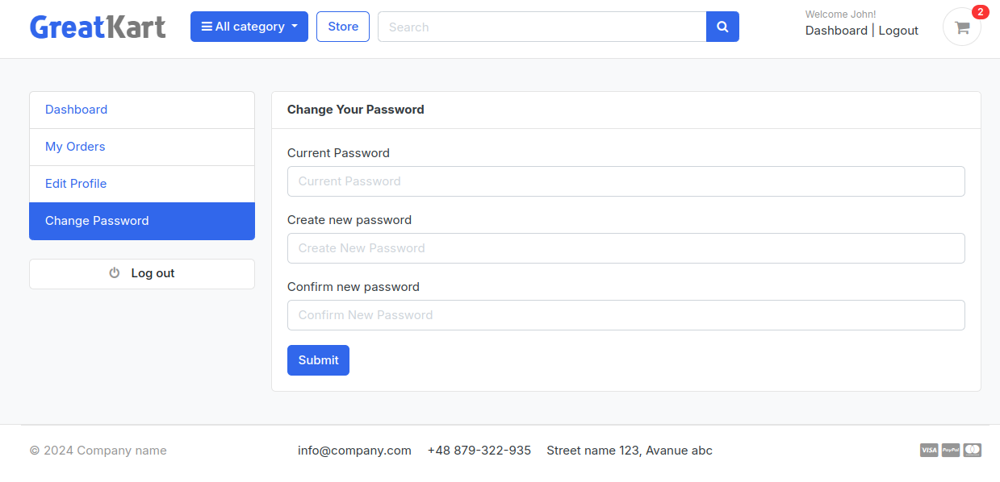

#### You can also review purchased product:
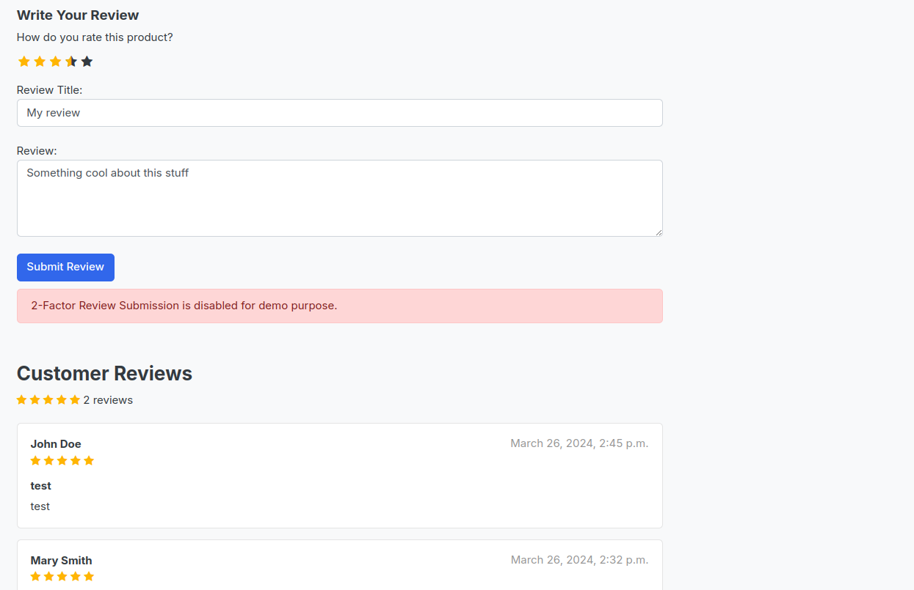

#### If you forget the password you can change it also using gmail:
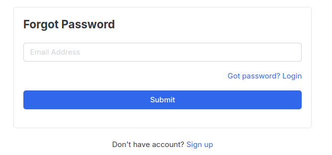